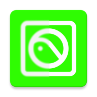
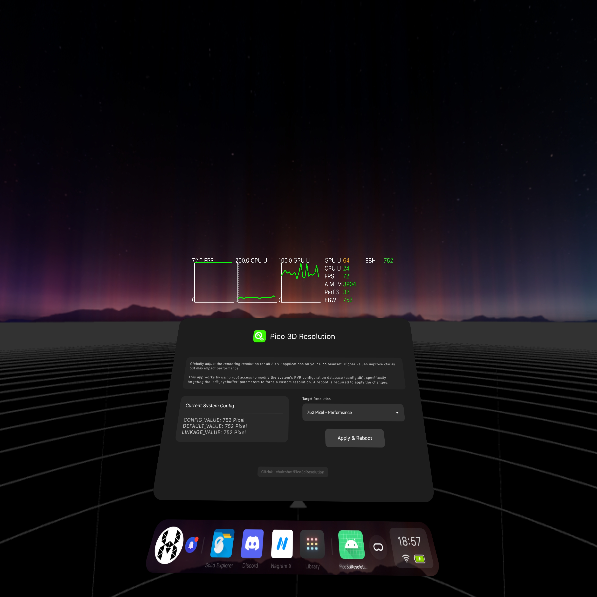

# Pico3dResolution

[English](README.md) | [中文](README_zh.md) | [Русский](README_ru.md)

### 🚀 Простой инструмент для глобальной настройки разрешения 3D-рендеринга для VR-шлемов Pico.

## 👓 Скриншот

## 🌟 Ключевые особенности

*   **🎯 Глобальное масштабирование разрешения**: Изменение внутреннего разрешения рендеринга для всех 3D VR приложений.
*   **📊 Оптимизированные пресеты**: Выбирайте из предустановленных значений, оптимизированных для производительности или четкости:
    *   **384px**: Ультра производительность
    *   **752px**: Производительность
    *   **1504px**: По умолчанию
    *   **2160px**: Родное разрешение
    *   **2448px**: Специально для Pico
    *   **3240px**: Сглаживание (Anti-aliasing)
*   **🔍 Проверка в реальном времени**: Автоматически проверяет успешность изменений в базе данных перед перезагрузкой.
*   **🛠️ Стиль PICO uUI**: Нативный интерфейс, созданный с помощью Jetpack Compose и Material 3.
*   **🌍 Многоязычная поддержка**: Поддерживает 27 языков, включая английский, китайский, русский, тайский и другие.
*   **🔐 Безопасность Root**: Использует команды `content` для безопасного изменения конфигурации PVR системы.

## ⛏️ Предварительные условия

*   **VR-шлем Pico** (Pico 4, Pico Neo 3 и т. д.)
*   **Root-доступ** (требуется Magisk)
*   **Разрешение суперпользователя**: Предоставьте root-доступ по запросу приложения.

## 📖 Как пользоваться?

1.  **Скачайте и установите** последний `Pico3dResolution.apk`.
2.  **Откройте приложение** и предоставьте права **Root/Superuser** по запросу.
3.  **Выберите целевое разрешение** из выпадающего списка.
4.  **Нажмите "Apply & Reboot"** (Применить и перезагрузить).
5.  Приложение обновит системную базу данных и проверит значения.
6.  **Дождитесь перезагрузки шлема**. Ваше новое разрешение активировано!

## ⁉️ FAQ / Поиск и устранение неисправностей

*   **Почему нужна перезагрузка?**
    *   Служба Pico VR и композитор выделяют свои внутренние буферы рендеринга только при запуске. Перезагрузка необходима, чтобы заставить систему прочитать новые значения `sdk_eyebuffer` из базы данных.
*   **Повлияет ли это на производительность?**
    *   Да. Высокое разрешение (например, 2160px или 3240px) значительно увеличивает нагрузку на GPU. В некоторых играх может наблюдаться падение частоты кадров или повышенный нагрев.
*   **Как проверить изменения?**
    *   Вы можете использовать **PICO Metrics Tool**, чтобы увидеть активные значения "EBW" (Eye Buffer Width) и "EBH" (Eye Buffer Height) в реальном времени внутри шлема.

## 🛠️ Технические подробности

### Как это работает
Это приложение использует root-доступ для изменения системной базы данных конфигурации PVR (`/data/user_de/0/com.pvr.configuration/databases/config.db`). Оно специально нацелено на параметры `sdk_eyebuffer` в таблицах `ConfigBean` и `RuleBean`, используя API команд Android `content`.

## 💖 Особая благодарность

*   **[pico-resfix](https://github.com/picoxr/resfix)**: Вдохновение для работы с конфигурацией.
*   **[Jetpack Compose](https://developer.android.com/compose)**: Современный набор инструментов для UI.
*   **[Material 3](https://m3.material.io/)**: Компоненты системы дизайна.

## 🔗 Ссылки на проект

*   **GitHub**: [chaixshot/Pico3dResolution](https://github.com/chaixshot/Pico3dResolution)
*   **Разработчик**: [hamer](https://github.com/hamer)
